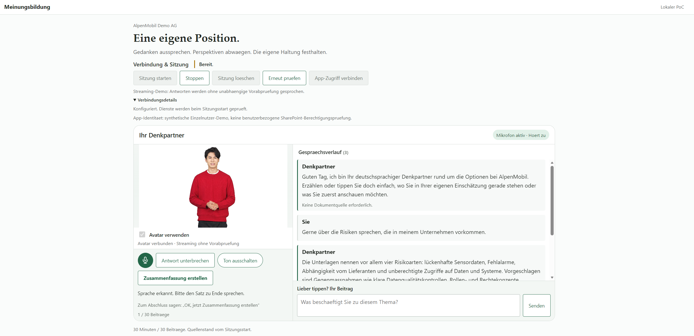
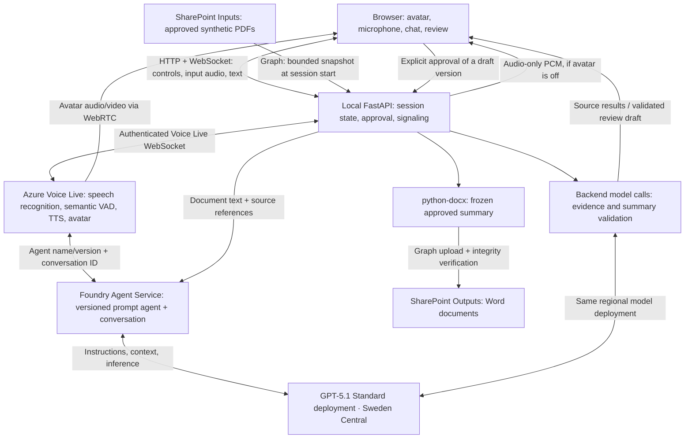

# Opinion Voice PoC

A German-speaking voice/text thinking partner for discussing approved fictional
railway documents and saving a reviewed opinion summary to SharePoint.

**Scope:** presenter-led, localhost, single-user, synthetic-data demonstration.
Not a production service or a claim of per-user SharePoint permission trimming.

## Demo preview



*Screenshot of the synthetic demo, provided by the operator on 14 September 2026.*

## Current state — 14 September 2026

- Streaming conversation with a native Foundry Voice Live avatar and audio-only
  fallback. The operator reports successful avatar use after the ICE-handshake fix.
- Unified avatar/chat layout, attached text input, accessible microphone icons,
  interruption controls and a separate review area.
- One Foundry prompt agent backed by **GPT-5.1 `2025-11-13`, Standard in Sweden
  Central**. The previous Global Standard deployment was removed.
- Current local presentation: stock **Harry / casual**, with the German male
  **Florian HD** voice. Voice Live accepted this combination; HD audio generation
  was exercised live. Subjective voice quality remains a rehearsal decision.
- Six approved SharePoint PDFs are read at session start. Real PDF retrieval,
  reviewed Word upload/download and duplicate-free save retries have passed.
- Natural summary requests, including longer affirmative German phrases, trigger
  the same validated review workflow as the button—not an automatic save.
- Conversational speech is instructed to omit technical citation markers.
  Streaming sources are checked separately **after** the answer and attached to
  the correct transcript entry. A live factual-answer probe produced audio
  without markers and subsequently recovered valid source references.

Earlier complete real-service checks used a synthetic browser microphone. They
do not establish universal human audio quality, noisy-room performance, model
correctness or a latency SLA. See [test evidence](docs/testing.md) and the
[handoff](docs/handoff.md) for observed results and remaining limitations.

## Technical architecture



### Voice Live, the agent and the model

These are complementary components—not three independent conversational models:

1. **FastAPI prepares the conversation.** Graph reads only manifest-listed PDFs
   from the configured input folder. Extracted page text, source references and
   versions form a bounded session snapshot. There is no per-turn SharePoint
   search, vector database or repository-file fallback.
2. **The Foundry prompt agent defines behavior.** Its versioned instructions
   reference the deployed model. The backend connects Voice Live using the
   project, agent name/version and the existing conversation ID.
3. **GPT-5.1 generates the answer.** Spoken and typed inputs share that conversation.
   Voice Live provides transcription, multilingual semantic VAD, noise reduction,
   speech synthesis and optional avatar output.
4. **The browser receives media.** Avatar sessions negotiate WebRTC through the
   backend and receive native audio/video directly. Audio-only sessions receive
   PCM over the application WebSocket. Only one playback path is active.

The browser sends an SDP offer after ICE gathering completes or a bounded
three-second wait. Offers are sent once; negotiation errors are explicit and
provide an audio-only restart option. Signaling is validated and bounded rather
than forwarding arbitrary browser events to Azure.

### Streaming versus strict mode

| Mode | Speech delivery | Sources and assurance |
|---|---|---|
| `streaming` | Audio/avatar starts as output arrives. | No independent pre-speech validation. A separate post-response check supplies source references or a visible unsupported/incomplete status. |
| `strict` | Audio-only response is buffered until the evidence check passes. | Independent pre-playback checking, with additional latency. Native avatar is not enabled in this mode. |

**Strict remains the code/template default.** Streaming is an explicit, visible
demo tradeoff. Post-response attribution cannot retract an unsupported statement
already heard. It has at most two in-flight checks; excess or failed checks are
marked incomplete. It incurs model usage but does not block the audio path.

Document IDs and URLs are added by the application as clickable references, not
intentionally included in spoken text. This relies on the conversational
instructions avoiding inline markers; it is **not a deterministic speech filter**
or a guarantee that the model can never verbalize a reference.

### Summary and save

```text
Spoken request or Finish button
  → same conversation + regional model → structured draft
  → factual/source/position validation → review UI
  → optional versioned edits → validation again
  → explicit approval → frozen DOCX → Graph upload → confirmed link
```

Summary generation uses a direct backend model request with the existing
conversation and repository instructions; it does not create a second agent.
The separate validator checks facts, source adequacy and the user's expressed
position. A subjective edit is allowed to change that position, but not invent
document facts.

Every summary preserves these headings:

- **Haltung zum Thema**
- **Fragen, die noch geklärt werden müssen**
- **Gegenpositionen**

The backend supplies identity attribution, destination, filename and version.
Stale approvals and unvalidated drafts cannot be saved. Retries reuse the same
approved document and remote item rather than silently overwriting unrelated
content. SharePoint can add Office package metadata, so DOCX verification
preserves authored content while allowing narrowly recognized metadata changes;
raw ZIP byte equality is not claimed.

## Run locally

Requirements: Python 3.12, [uv](https://docs.astral.sh/uv/), Azure CLI sign-in for
Foundry, and an approved Graph identity with access to the configured folders.
For avatars, use a browser with H.264 WebRTC support, such as an appropriately
configured desktop Chrome or Edge. The network must permit the required
WebRTC/TURN connectivity.

For a new checkout, copy [.env.example](.env.example) to ignored `.env` and fill in
real configuration from deployment outputs; do not overwrite an existing setup.
The detailed [setup guide](docs/setup.md) covers Azure and Microsoft 365.

```bash
uv sync --locked --no-dev
uv run --frozen --no-sync uvicorn app.main:app \
  --host 127.0.0.1 --port 8010 --no-access-log
```

Open **http://localhost:8010**. Keep the terminal running. `npm start` is an
alternative shortcut on port **8000**, not 8010.

1. Select **App-Zugriff verbinden** in application mode.
2. Optionally enable **Avatar verwenden**, then start a session.
3. Enable the microphone explicitly, or type in the attached chat composer.
4. Say **“Fasse unser Gespräch bitte zusammen”** or use the summary button.
5. Review the draft, apply any edits, then explicitly approve saving.

A request such as “Zusammenfassung erstellen und freigeben” creates the review
draft; it does not approve an unseen version. Recognition supports a bounded set
of natural affirmative constructions, not unrestricted language understanding.
Negative, quoted/reported and ambiguous commands do not silently trigger saving.

Stop releases the voice connection. Session deletion also removes its Foundry
conversation, but **does not delete saved SharePoint files**. To avoid duplicate
greetings/context, the same voice session cannot reconnect; create a new session.
HTTP review/save recovery remains available after a voice disconnect.

## Configuration and identity

Representative non-secret choices for the approved demo:

```dotenv
FOUNDRY_MODEL_DEPLOYMENT_NAME=gpt-5.1
VOICE_DELIVERY_MODE=streaming
VOICE_AVATAR_ENABLED=true
VOICE_AVATAR_CHARACTER=harry
VOICE_AVATAR_STYLE=casual
VOICE_NAME=de-DE-Florian:DragonHDLatestNeural
GRAPH_AUTH_MODE=application
GRAPH_APPLICATION_CREDENTIALS_FILE=.env.graph-application
```

`VOICE_AVATAR_ENABLED` is the active avatar capability flag; the legacy
`AVATAR_ENABLED` setting is not used. Avatar selection is also required per session.

| Service | Identity used |
|---|---|
| Foundry and Voice Live | Backend Azure CLI credential in the configured tenant |
| SharePoint, application mode | Explicitly approved application with existing `Sites.Selected` grants |
| SharePoint, delegated alternative | Public-client device sign-in with `User.Read` + `Files.ReadWrite`; this route returned folder-access 403s in the demo tenant |
| Browser | Local session cookie/origin checks; no Azure service bearer token or client secret |

The separate ignored application-credential file contains `GRAPH_TENANT_ID`,
`GRAPH_APP_CLIENT_ID` and `GRAPH_APP_CLIENT_SECRET`. Only these settings are used;
the file does not override other application configuration. Required short-lived
ICE credentials reach the browser for WebRTC but are not recorded.

Prefer configured canonical folder URLs plus verified drive/folder IDs. Sharing
links are also supported for metadata resolution, but the app never automatically
redeems links or grants new access. Input and output must be distinct,
non-overlapping folders.

**Application identity is not per-participant authorization.** Folder/manifest
checks do not reduce the token to two folders or change SharePoint ACLs. No
anonymous sharing links, additional consent grants or permission broadening are
performed as an automatic fallback.

## Diagnostics and verification

Connection failures show a **Diagnose-ID** linked to terminal output and private,
rotating, ignored `.local/diagnostics.jsonl` records:

```bash
tail -n 5 .local/diagnostics.jsonl
```

Diagnostics retain safe browser WebRTC states, codecs, ICE error codes, service
messages and correlation IDs. They omit raw SDP, ICE credentials, access tokens
and conversation/media dumps. Review even redacted logs before sharing.

Explicit live commands, run only against approved synthetic destinations:

```bash
# Read-only folder metadata, no document contents:
uv run --frozen --no-sync python scripts/live_check.py --resolve-folders

# Billable Foundry model call:
uv run --frozen --no-sync python scripts/live_check.py --foundry-only

# Writes the six approved synthetic PDFs; then reads them back:
uv run --frozen --no-sync python scripts/live_check.py --upload-corpus

# Writes/downloads a synthetic Word example:
uv run --frozen --no-sync python scripts/live_check.py --save-example
```

Local tests are available but no CI/full-suite gate is required for this demo:

```bash
uv sync --locked
npm ci
npx playwright install chromium
uv run --frozen --no-sync pytest
npx playwright test
```

Browser tests use an isolated server on port 8765 and explicitly clear cloud
configuration. Mocked signaling tests do not prove real avatar frames or network
compatibility. The installed Linux test Chromium previously lacked H.264 even
though the operator's desktop browser supported it.

## Limits and deployment boundaries

- Six manifest PDFs maximum, eight pages and 2 MB per PDF, 100000 extracted
  characters total. Source ID/version is rechecked during download; no silent
  truncation or cross-session corpus cache.
- Session limits: 30 user turns, 30000 user-text characters, 30 minutes.
  Source changes are picked up on a new session; mid-session permission changes
  are not continuously rechecked.
- In-memory sessions/tokens. Crashes can leave service-side conversations;
  cleanup is limited to known owned artifacts, never an entire shared site.
- Model deployment is GPT-5.1 Standard in Sweden Central. Provisioning rejects
  global SKUs. Standard processing is bounded to the selected Azure geography,
  not a fixed datacenter. This is not an end-to-end EU Data Boundary certification
  for all Speech, Foundry and Microsoft 365 processing.
- Existing C2 reduced-scope and multi-user/privacy limitations remain. Streaming,
  model validation and synthetic tests are not production assurance.
- No raw human-audio persistence by default. Never commit `.env*` credentials,
  local logs, private summaries or reference checkouts.

## Code map and further reading

| Path | Responsibility |
|---|---|
| `app/main.py`, `app/sessions.py` | Local API, authoritative session/review/version/save state |
| `app/voice.py`, `app/avatar.py` | Voice Live events, spoken commands, media/signaling bounds |
| `app/foundry.py`, `app/source_attribution.py` | Agent setup, model requests, validation, asynchronous sources |
| `app/graph.py`, `app/grounding.py` | Identity, approved folder/file access and PDF snapshot |
| `app/export.py`, `app/document_integrity.py` | DOCX rendering and stored-content verification |
| `app/static/` | Vanilla browser UI, WebRTC avatar, microphone AudioWorklet |
| `agent/instructions.md`, `sample-data/` | Versioned behavior and synthetic corpus source |
| `infra/`, `scripts/` | Bicep, setup and explicitly invoked diagnostics |

- [Setup and troubleshooting](docs/setup.md)
- [Current handoff](docs/handoff.md)
- [Test evidence and limitations](docs/testing.md)
- [Agreed v2 plan](docs/demo-v2-plan.md) and [implementation brief](plan.md)
- [Voice Live with Foundry agents](https://learn.microsoft.com/en-us/azure/ai-services/speech-service/voice-live-agents-quickstart)
- [Standard avatars](https://learn.microsoft.com/en-us/azure/ai-services/speech-service/text-to-speech-avatar/standard-avatars)
- [Deployment types and processing geography](https://learn.microsoft.com/en-us/azure/foundry/foundry-models/concepts/deployment-types)
- [Salescoach reference](https://github.com/Azure-Samples/voicelive-api-salescoach):
  reference for native avatar signaling and conversational UI patterns, not a
  replacement for this app's SharePoint, validation or approval architecture.
